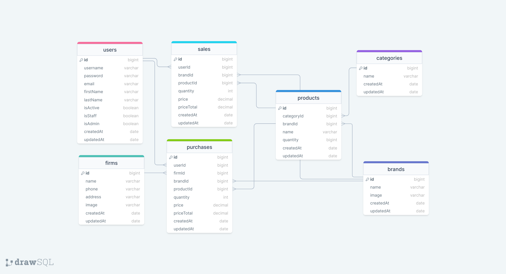

# STOCK MANAGEMENT API

#user_stories:
```


- maine  ve dev'e pushlamayalim
- kendi branchimiz ile calisip conflictleri giderip deve pr isteyelim
- bir collectioni aldiysaniz karsina isminiz ve inprogress yazarsaniz iyi olur
- bir colelctioni alan model, controller, router kisimlarini tam yapsin
- asagidaki siaraya gore alip yapalim


                  dev          status
_________________________________________
- user      -   ibrsec   -   inprogress |
- token     -   ibrsec   -   inprogress |
- auth      -                           |
- brand     -                           |
- category  -                           |
- firm      -                           |
- product   -                           |
- purchase  -                           |
- sale      -                           |
_________________________________________

```


### ERD:



### ERD-2 (snake_case):


### Folder/File Structure:

```
    .env
    .gitignore
    index.js
    package.json
    readme.md
    src/
        config/
            dbConnection.js
            swagger.json
        controllers/
            auth.js
            brand.js
            category.js
            firm.js
            product.js
            purchase.js
            sale.js
            token.js
            user.js
        helpers/
            passwordEncrypt.js
            sendMail.js
        middlewares/
            authentication.js
            errorHandler.js
            findSearchSortPage.js
            logger.js
            permissions.js
            upload.js
        models/
            brand.js
            category.js
            firm.js
            product.js
            purchase.js
            sale.js
            token.js
            user.js
        routes/
            auth.js
            brand.js
            category.js
            document.js
            firm.js
            index.js
            product.js
            purchase.js
            sale.js
            token.js
            user.js
```